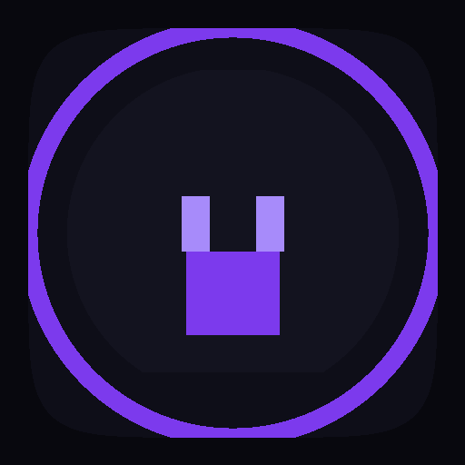

<div align="center">
  
  <h1>LeakGuard CaseDesk</h1>
  <p>Plataforma de investigação e triagem de incidentes DLP para times de SOC e Segurança da Informação.</p>

  
  
  
  
  
  
</div>

---

## Visão Geral

LeakGuard CaseDesk é uma aplicação **desktop** (Windows `.exe`) criada para analistas de SOC investigarem incidentes de vazamento de dados com precisão e agilidade. A ferramenta centraliza todo o fluxo operacional — do alerta ao relatório formal — sem exigir que o analista alterne entre múltiplas plataformas.

O produto é desenhado como uma **ferramenta operacional real**, não um dashboard genérico. A tela principal abre diretamente na fila de casos. Cada incidente pode ser aberto, investigado e encerrado sem sair da aplicação.

---

## Problema Resolvido

Times de SOC recebem alertas DLP de múltiplas origens (gateway de e-mail, CASB, endpoint, proxy web) mas não têm um ambiente centralizado para investigar, documentar e responder. O analista precisa alternar entre 4 a 6 ferramentas para fechar um único incidente — perdendo contexto, tempo e rastreabilidade.

**LeakGuard CaseDesk resolve isso com uma mesa de trabalho digital unificada:**

| Antes | Com o CaseDesk |
|-------|---------------|
| Alertas fragmentados em múltiplas ferramentas | Fila de casos única com KPIs operacionais |
| Análise manual sem estrutura | Mesa de trabalho com evidência, dados e fluxo do evento |
| Parecer técnico informal | Parecer estruturado gerado por IA com base legal LGPD |
| Relatório montado no Word/Excel | Relatório formal exportado em PDF / DOCX / XLSX / JSON |
| Trilha de auditoria inexistente | Cada ação do analista registrada com actor, timestamp e detalhes |

---

## Funcionalidades

### Caixa de Entrada
- [x] Fila de casos com KPIs operacionais em tempo real (recebidos hoje, em análise, aguardando ação, SLA crítico)
- [x] Filtros por severidade, status e canal de origem
- [x] Busca por ID, título e usuário
- [x] Painel de preview lateral sem sair da fila
- [x] Abertura direta na Mesa de Trabalho com um clique

### Mesa de Trabalho
- [x] Evidência bruta (cabeçalhos de e-mail, corpo, metadados do anexo)
- [x] Dados sensíveis detectados com contagem por tipo (CPF, e-mail, telefone)
- [x] Mascaramento automático com revelação explícita pelo analista
- [x] Fluxo visual do evento: usuário → arquivo → canal → destino → política → risco
- [x] Parecer técnico da IA com severidade, confiança e base legal LGPD
- [x] Linha do tempo do incidente (trilha de auditoria)
- [x] Ações: conter, exportar, escalar, gerar relatório

### Evidências
- [x] Preview de planilhas com mascaramento de campos PII
- [x] Hash SHA-256 para integridade e cadeia de custódia
- [x] Metadados: origem, data de captura, classificação, destino

### Copilot IA
- [x] Plano de resposta estruturado por fase (contenção, investigação, comunicação, encerramento)
- [x] Análise de conformidade LGPD com checklist
- [x] Resumo executivo para CISO/DPO
- [x] Interface conversacional com histórico

### Relatórios
- [x] Documento formal de incidente com todos os campos preenchidos automaticamente
- [x] Exportação multi-formato: PDF, DOCX, XLSX, JSON
- [x] Assinatura digital e controle de versão (v1, v2...)

### Políticas DLP
- [x] Listagem de políticas com status (ativa, rascunho, arquivada)
- [x] Canais monitorados, ações configuradas e histórico de alterações
- [x] Edição inline

---

## Stack

| Camada | Tecnologia |
|--------|-----------|
| Framework UI | React 19 |
| Linguagem | TypeScript 5 |
| Build | Vite 8 |
| Estilos | Tailwind CSS v4 (`@theme` tokens) |
| Estado global | Zustand |
| Ícones | Lucide React |
| Desktop | Electron 42 + electron-builder |
| Desktop alternativo | Tauri v2 (requer Rust) |

---

## Arquitetura

```
leakguard-casedesk/
├── src/
│   ├── routes/          # Fonte única de verdade para PageId, labels e ícones
│   │   └── index.tsx
│   ├── types/           # Interfaces TypeScript globais
│   │   └── index.ts     # Case, Evidence, Policy, AIAnalysis, AuditLog...
│   ├── data/            # Mock data realista (substituir por API em produção)
│   │   └── mockData.ts
│   ├── store/           # Estado global com Zustand
│   │   └── useAppStore.ts
│   ├── lib/             # Utilitários puros (cn, formatDate, formatDateTime)
│   ├── styles/          # Design system
│   │   └── globals.css  # @theme tokens + reset + animações CSS
│   ├── components/
│   │   ├── layout/      # AppShell, TopBar, SideNav
│   │   └── ui/          # Badge, Button
│   └── pages/           # Uma pasta por tela
│       ├── Login/
│       ├── CaseInbox/
│       ├── CaseWorkbench/
│       ├── Evidence/
│       ├── Copilot/
│       ├── Reports/
│       └── Policies/
├── electron/
│   └── main.cjs         # BrowserWindow, menu, deep link
├── public/
│   └── logo.png
└── docs/
    ├── product.md
    ├── architecture.md
    └── security.md
```

**Fluxo de dados:**

```
mockData.ts  →  useAppStore (Zustand)  →  componentes via hooks
                      ↑
               actions: login, navigate, selectCase,
                        openCaseWorkbench, updateCaseStatus
```

**Roteamento:** sem React Router. Navegação por estado (`currentPage: PageId`). `AppShell` faz o switch entre páginas. `routes/index.tsx` é a fonte única de verdade para IDs, labels e ícones.

---

## Telas

| Módulo | Função | Destaques técnicos |
|--------|--------|-------------------|
| **Caixa de Entrada** | Triagem de incidentes com KPIs operacionais | Filtros, busca, preview lateral, abertura direta na Mesa |
| **Mesa de Trabalho** | Investigação: evidência bruta, dados detectados, fluxo, IA | Mascaramento PII, fluxo visual, parecer IA, ações do analista |
| **Evidências** | Artefatos com preview, hash e cadeia de custódia | Preview XLSX maskado, SHA-256, metadados de captura |
| **Copilot IA** | Assistente operacional com plano de resposta | Análise LGPD, resumo executivo, interface conversacional |
| **Relatórios** | Documento formal de incidente | Exportação PDF/DOCX/XLSX/JSON, versionamento |
| **Políticas DLP** | Gestão de regras e canais | Edição inline, histórico de alterações |
| **Login** | Autenticação corporativa | Validação de e-mail + senha, suporte a SSO em produção |

---

## Como Rodar

```bash
# 1. Instalar dependências
npm install

# 2. Modo web (desenvolvimento)
npm run dev
# → http://localhost:5173
# A aplicação abre diretamente na Caixa de Casos (sem login em modo demo)

# 3. Build desktop (.exe Windows)
npm run build
npx electron-builder --win
# → release/LeakGuard-CaseDesk-Portable.exe
#   release/LeakGuard-CaseDesk-Setup.exe

# 4. Build alternativo com Tauri (binário menor, requer Rust)
# curl --proto '=https' --tlsv1.2 -sSf https://sh.rustup.rs | sh
npm run tauri:build
```

> **Credenciais demo:** a tela de login aceita qualquer e-mail válido + senha com 6+ caracteres.

---

## Roadmap

### v1.1 — Integração
- [ ] Conector de API REST para ingestão de alertas (Symantec DLP, Microsoft Purview, Forcepoint)
- [ ] Webhooks de saída para SIEM (Splunk, Microsoft Sentinel)
- [ ] Autenticação via OAuth 2.0 / SAML / Azure AD SSO

### v1.2 — IA Real
- [ ] Integração com Claude API para parecer técnico real
- [ ] Análise automática de conteúdo do arquivo com classificação de dados sensíveis
- [ ] Sugestão de política baseada no padrão do incidente

### v1.3 — Colaboração
- [ ] Atribuição de casos entre analistas
- [ ] Comentários e notas na Mesa de Trabalho
- [ ] Notificações em tempo real (WebSocket)

### v2.0 — Plataforma
- [ ] Backend persistente (PostgreSQL + Node.js)
- [ ] Multi-tenant com separação por organização
- [ ] Dashboard executivo para CISO/DPO
- [ ] App web responsivo (além do desktop)

---

## Boas Práticas de Segurança

| Prática | Implementação atual | Produção |
|---------|-------------------|---------|
| **Mascaramento PII** | `blur-[3px]` com toggle explícito "Revelar" | Criptografia AES-256 em repouso |
| **Autenticação** | Validação local (demo) | OAuth 2.0 + MFA obrigatório |
| **Sessão** | Estado em memória | JWT com expiração curta + refresh token em `httpOnly` cookie |
| **Electron** | `contextIsolation: true`, `nodeIntegration: false` | `contextBridge` para IPC, `sandbox: true`, CSP restritiva |
| **Trilha de auditoria** | `AuditLog` com actor, action, timestamp | Backend imutável, assinado digitalmente, backup externo |
| **Cadeia de custódia** | Hash SHA-256 por evidência | Verificação antes de qualquer exportação |
| **Dados mockados** | Nenhuma informação real no código-fonte | Variáveis de ambiente para credenciais, secrets manager |
| **Transport** | N/A (local) | TLS 1.3 mínimo, HSTS |

**LGPD — Referências implementadas:**
- Art. 6º — Princípio da finalidade, adequação e necessidade
- Art. 46 — Segurança no tratamento de dados pessoais
- Art. 48 — Comunicação de incidentes à ANPD (prazo 72h exibido no Copilot)
- Base legal exibida no parecer de IA de cada incidente

---

## Status do Projeto

| Componente | Status |
|-----------|--------|
| UI / Design system | ✅ Completo |
| Caixa de Entrada | ✅ Completo |
| Mesa de Trabalho | ✅ Completo |
| Evidências | ✅ Completo |
| Copilot IA | ✅ Completo (mock) |
| Relatórios | ✅ Completo (mock) |
| Políticas DLP | ✅ Completo |
| Build Windows `.exe` | ✅ Funcionando |
| Backend / API real | 🔲 Roadmap v1.1 |
| IA real (Claude API) | 🔲 Roadmap v1.2 |
| Autenticação SSO | 🔲 Roadmap v1.1 |
| Testes automatizados | 🔲 Roadmap |

> Projeto em desenvolvimento ativo. Contribuições e feedback são bem-vindos via [Issues](../../issues).

---

## Documentação

- [Produto](docs/product.md) — fluxo, módulos e personas
- [Arquitetura](docs/architecture.md) — estrutura, estado e roteamento
- [Segurança](docs/security.md) — práticas, LGPD e recomendações para produção

---

## Design

Paleta escura com roxo ametista como destaque principal. Tipografia Inter + JetBrains Mono. Visual inspirado em Obsidian, Linear e ferramentas forenses corporativas.

| Token | Valor | Uso |
|-------|-------|-----|
| Background | `#08080E` | Fundo principal |
| Painel | `#0E0E18` | Superfícies |
| Accent | `#7C3AED` | Ações primárias |
| Lavender | `#A78BFA` | IDs, destaques |
| Crítico | `#DC2626` | Severidade crítica |
| Alto | `#EA580C` | Severidade alta |
| Médio | `#CA8A04` | Severidade média |
| Baixo | `#3B82F6` | Severidade baixa |

---

## Licença

MIT
